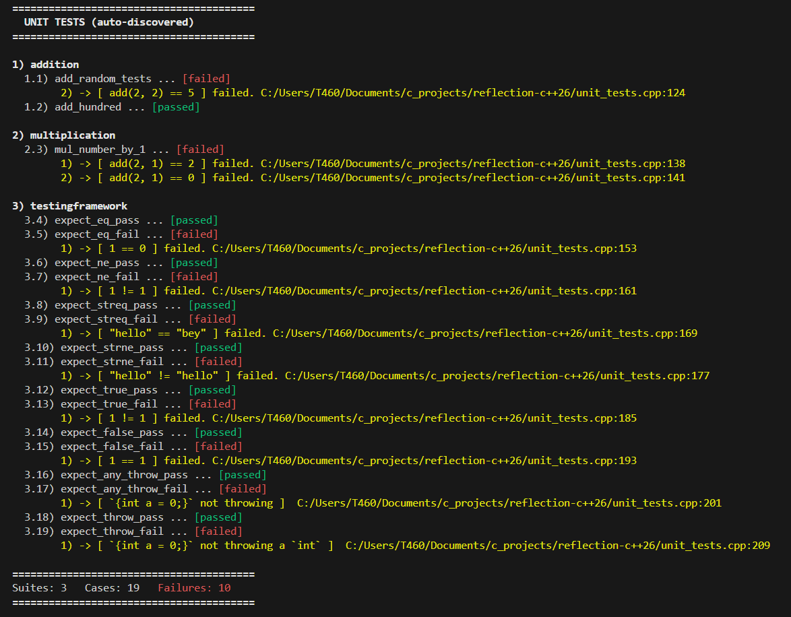

# 🚀 C++26 Reflection Playground

> Experiments with **C++26 static reflection (`-freflection`)** using GCC trunk.

This repository demonstrates powerful compile-time reflection features from the upcoming C++26 standard, including:

- 🧪 Reflection-based Unit Test Framework  
- 🖨️ Universal Struct Formatter  
- 🔁 Enum → String conversion  

---

# ⚙️ Requirements

- GCC trunk build with reflection enabled
- C++26 support
- Compile with:

---
# Unit Tests FrameWork using c++26 reflection

  

